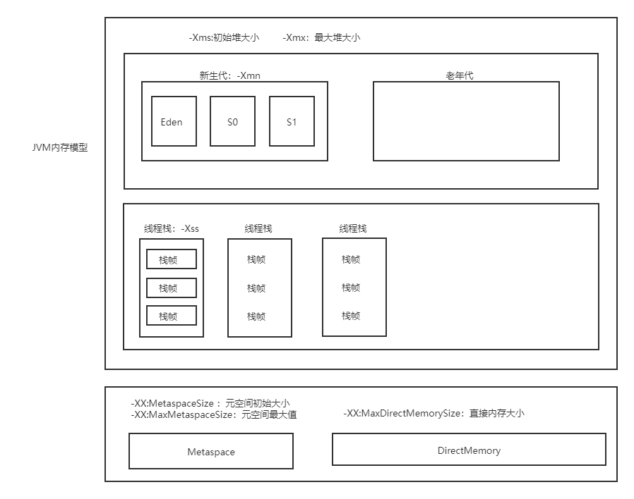

## 作业内容

> Week01 作业题目（周三）：

1、自己写一个简单的 Hello.java，里面需要涉及基本类型，四则运行，if 和 for，然后 自己分析一下对应的字节码，有问题群里讨论。
```
 0 bipush 10
 2 istore_1
 3 ldc2_w #2 <20.0>
 6 dstore_2
 7 iload_1
 8 i2d
 9 dload_2
10 dadd
11 dstore 4
13 ldc #4 <hello>
15 astore 6
17 aload 6
19 invokevirtual #5 <java/lang/String.toCharArray>
22 astore 7
24 aload 7
26 arraylength
27 istore 8
29 iconst_0
30 istore 9
32 iload 9
34 iload 8
36 if_icmpge 63 (+27)
39 aload 7
41 iload 9
43 caload
44 invokestatic #6 <java/lang/Character.valueOf>
47 astore 10
49 getstatic #7 <java/lang/System.out>
52 aload 10
54 invokevirtual #8 <java/io/PrintStream.println>
57 iinc 9 by 1
60 goto 32 (-28)
63 return

```
2、自定义一个 Classloader，加载一个 Hello.xlass 文件，执行 hello 方法，此文件内 容是一个 Hello.class 文件所有字节(x=255-x)处理后的文件。文件群里提供。

[作业跳转](/Week_01/code/HelloClassLoader.java)

3、画一张图，展示 Xmx、Xms、Xmn、Meta、DirectMemory、Xss 这些内存参数的 关系。

4、检查一下自己维护的业务系统的 JVM 参数配置，用 jstat 和 jstack、jmap 查看一下 详情，并且自己独立分析一下大概情况，思考有没有不合理的地方，如何改进。 注意:如果没有线上系统，可以自己 run 一个 web/java 项目。

> Week01 作业题目（周六）：

1.（选做）本机使用 G1 GC 启动一个程序，仿照课上案例分析一下 JVM 情况。

注意关闭自适应参数：-XX:-UseAdaptiveSizePolicy

> java -Xmx1g -Xms1g -XX:-UseAdaptiveSizePolicy -XX:+UseSerialGC -jar gateway-server-0.0.1-SNAPSHOT.jar
> java -Xmx1g -Xms1g -XX:-UseAdaptiveSizePolicy -XX:+UseParallelGC -jar gateway-server-0.0.1-SNAPSHOT.jar
> java -Xmx1g -Xms1g -XX:-UseAdaptiveSizePolicy -XX:+UseConcMarkSweepGC -jar gateway-server-0.0.1-SNAPSHOT.jar
> java -Xmx1g -Xms1g -XX:-UseAdaptiveSizePolicy -XX:+UseG1GC -XX:MaxGCPauseMillis=50 -jar gateway-server-0.0.1-SNAPSHOT.jar

> 如果jmc连不上进程，需要在启动的进程加上如下参数开启jmx
-XX:+UnlockCommercialFeatures -Dcom.sun.management.jmxremote.rmi.port=8192 -Dcom.sun.management.jmxremote=true -Dcom.sun.management.jmxremote.port=8192 -Dcom.sun.management.jmxremote.ssl=false -Dcom.sun.management.jmxremote.authenticate=false -Djava.rmi.server.hostname=localhost  