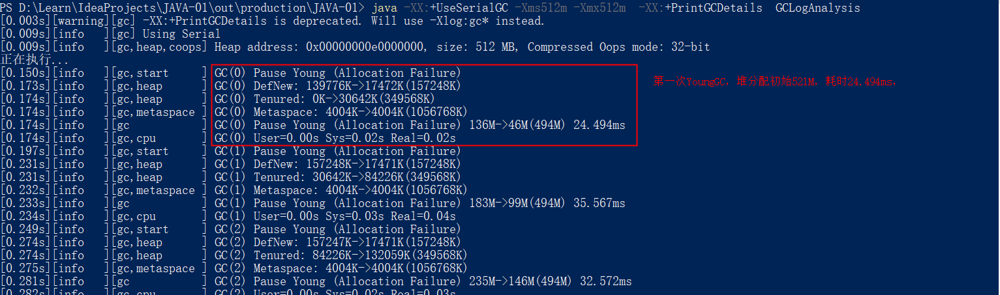
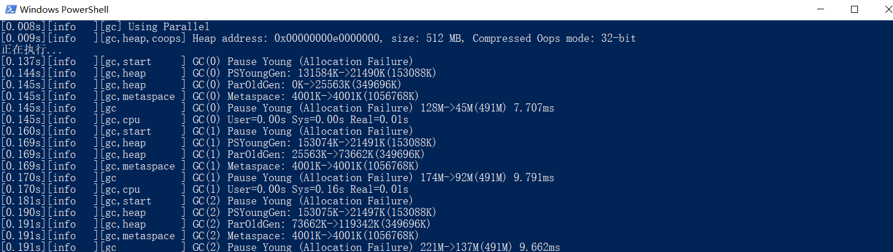
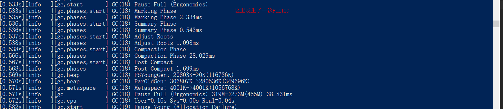
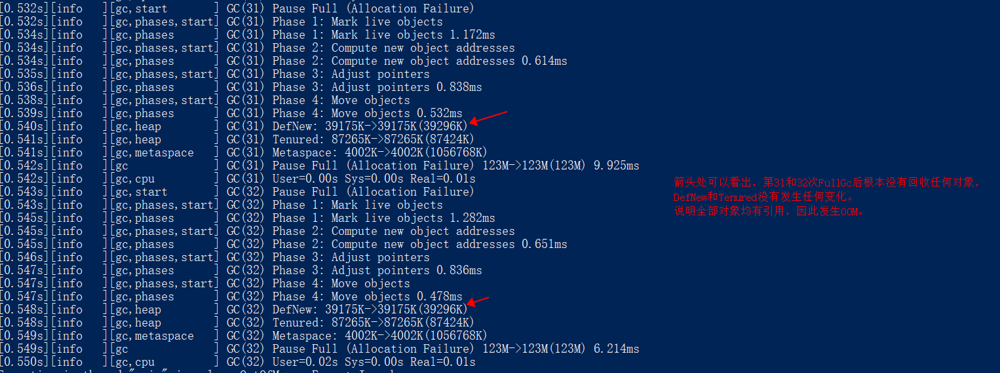
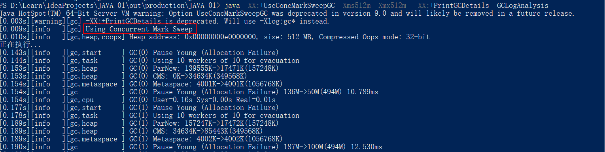
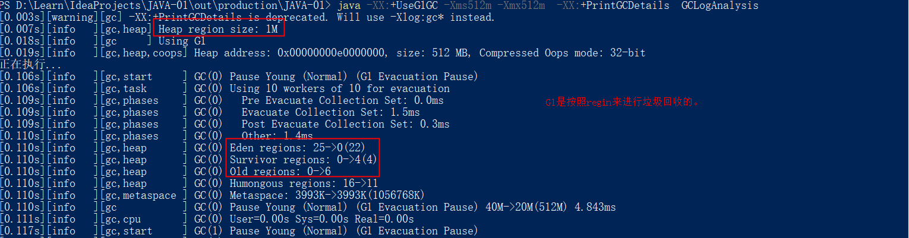
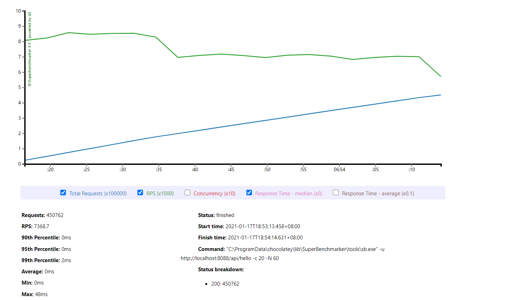
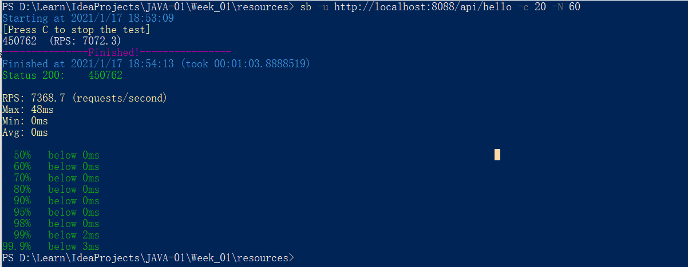
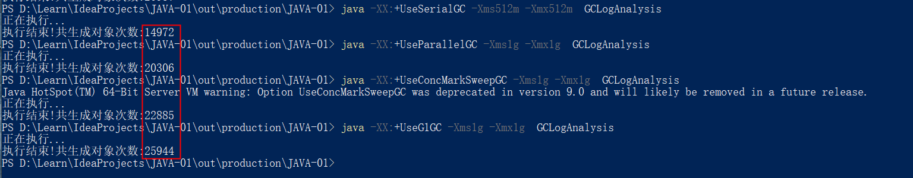

## 作业内容

> Week02 作业题目（周三）：

1、使用 [GCLogAnalysis.java](/Week_02/code/GCLogAnalysis.java) 自己演练一遍串行/并行/CMS/G1的案例。

串行GC：java -XX:+UseSerialGC -Xms512m -Xmx512m -Xloggc:gc.demo.log -XX:+PrintGCDetails -XX:+PrintGCDateStamps GCLogAnalysis

[0.137s][info   ][gc,start     ] GC(0) Pause Young (Allocation Failure)
[0.144s][info   ][gc,heap      ] GC(0) PSYoungGen: 131584K->21490K(153088K) 
> young区从131584K压缩成21490K，当前young区的容量为153088K。131584/153088 = 0.859，说明young区使用85%左右开始执行GC。

[0.145s][info   ][gc,heap      ] GC(0) ParOldGen: 0K->25563K(349696K)
> old区从0K到25563K，说明第一次youngGC就有25563K的对象被提升。

并行GC：
java -XX:+UseParallelGC -Xms512m -Xmx512m -XX:+PrintGCDetails GCLogAnalysis

java -XX:+UseParallelGC -Xms128m -Xmx128m -XX:+PrintGCDetails GCLogAnalysis
> 模拟OOM，发生时新生代和老年代无法回收任何对象。

CMS：
java -XX:+UseConcMarkSweepGC -Xms512m -Xmx512m  -XX:+PrintGCDetails  GCLogAnalysis

G1：
java -XX:+UseG1GC -Xms512m -Xmx512m  -XX:+PrintGCDetails  GCLogAnalysis

2、使用压测工具（wrk或sb），演练gateway-server-0.0.1-SNAPSHOT.jar示例。

3、(选做)如果自己本地有可以运行的项目，可以按照2的方式进行演练。

4、(必做)根据上述自己对于1和2的演示，写一段对于不同GC和堆内存的总结，提交到 github。

堆内存并不是也大越好， 堆内存过小，容易产生OOM。 堆太大，会造成单次垃圾回收时间过长，影响系统吞吐量。
从下图可以看出，相同的堆内存大小下，ParallelGC的性能要好于SerialGC。

> Week02 作业题目（周五）：

1.（选做）运行课上的例子，以及 Netty 的例子，分析相关现象。

2.（必做）写一段代码，使用 HttpClient 或 OkHttp 访问 http://localhost:8801 ，代码提交到 Github。

[HttpClientDemo.java](src/main/java/HttpClientDemo.java)
[OKHttpDemo.java](src/main/java/OKHttpDemo.java)